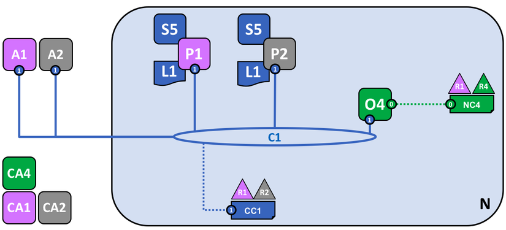

# Phần 1. Kiến trúc của Hyperledger Fabric
### **`Kiến trúc đầy đủ của Hyperledger Fabric (từ thời điểm này về sau gọi là HF)`**

### **`Kiến trúc đơn giản của Hyperledger Fabric`** (hình ảnh lấy từ phiên bản 2.2 cảu HF)

## các định nghĩa
Trong đó:\
**`N`** : (Network) Mạng.
> Network  một cơ sở hạ tầng kỹ thuật cung cấp sổ cái và hợp đồng thông minh (được đóng gói như một phần của dịch vụ “chaincode”) cho các ứng dụng

**`NC`**: Network Configuration ( Cấu hình của mạng ). (**`trong bản HF 2.2 vẫn còn tuy nhiên sang phiên bản mới nhất của HF thì khái niệm này đã không còn tồn tại`**)
> Network Configuration 

**`C`**: Channel ( Kênh ), tập hợp các tổ chức có vai trò nhất định trong cùng một quy trình kinh doanh.
> Channel kênh :có thể hiểu là nhiều tổ chức trong mạng ( **không nhất thiết phải là tất cả các tổ chức**) cùng hợp lại tạo thành một mạng lưới và các giao dịch trong mạng luwois này chỉ có các tổ chức tham gia vào kênh mới có quyền được thấy còn các tổ chức không tham gia vào kênh sẽ không có quyền được thấy các giao dịch trong kênh.

**`CC`**: Channel Configuration ( Cấu hình của kênh ).

**`R`**: Organization ( Tổ chức ).

**`O`**: Orderer Node: Nếu như trong Public Blockchain, tất cả các node của mạng đều tham gia vào quá trình đồng thuận, thì ở Hyperledger Fabric chỉ có Orderer tham gia vào quá trình đó.

**`P`**: Peer, là điểm tương tác giữa các thành viên trong tổ chức tương ứng với kênh, mọi hành động của người dùng đều phải đi qua peer.

**`S`**: Smart Contract (Chaincode) được cài đặt trên kênh, định nghĩa rõ các struct, các hành động mà người dùng có thể thực hiện để tương tác trạng thái của struct được lưu trong sổ cái(**một smart contract định nghĩa các logic giao dịch, sau đó smart contract được đóng gói thành chaincode** ).

**`L`**: Ledger ( Sổ cái ), lưu trữ trạng thái của các đối tượng.
> Ví dụ\
> car01 := Car{CarID: "Merc", OwnerID: "thienthangaycanh", Description: "ABC" }\
>
>Đối tượng car01 sẽ được lưu vào sổ cái dưới dạng key-value, key được xác định như thế nào thì tùy thuộc vào người code Smart Contract, còn value là giá trị của car01 được đưa về dạng byte[].

**`CA`**: Certificate Authority, phát hành identity cho người dùng hoặc node của tổ chức tương ứng. Ví dụ, người dùng A là thành viên của Tổ chức R1, khi muốn tham gia vào mạng thì sẽ gửi yêu cầu đến CA1, sau đó CA1 sẽ tạo ra một identity gồm private-key, public-key và các đặc tính liên quan khác, sau đó trả về cho người dùng A, từ đó về sau A dùng identity đó để thực hiện các tương tác với mạng, mạng sẽ tự động biết đó là người dùng A đến từ tổ chức R1.

**`A`**: Application, ứng dụng hay giao diện (web, mobile app ) giúp người dùng tương tác với hệ thống dễ dàng hơn.

# Phần 2: identity (định danh)

### **`2.1 Định danh`**
 Mỗi tác nhân trong HF bao gồm peers, orderer, client, admin,.. đều có một identity. Các tác nhân này sẽ sử dụng identity của mình để tương tác với mạng, identity đó được cấp dưới dạng một X.509 digital certificate. Các identity rất quan trọng vì nó còn giúp hệ thống xác định tác nhân có thể thực hiện những hành động nào, có quyền truy cập vào những tài nguyên nào của network.

### **`2.2 Public key Infrastructue (PKI)`**
Là tập hợp các internet technologies cung cấp sự liên lạc an toàn trong network.\
Trong ngữ cảnh Hyperledger Fabric network thì PKI là tập hợp các Certificate Authorities (CA)\

> Mục đích của PKI là dùng để xác minh danh tính cho 

